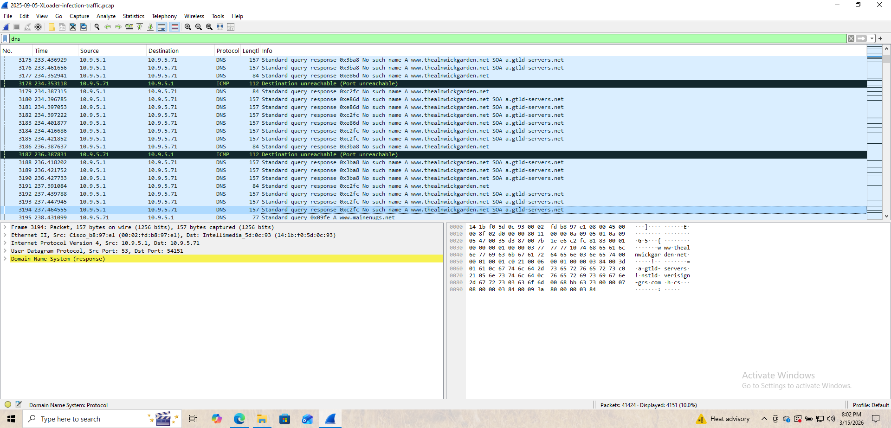
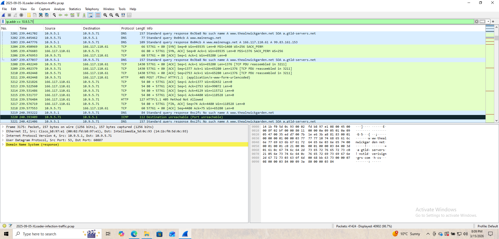
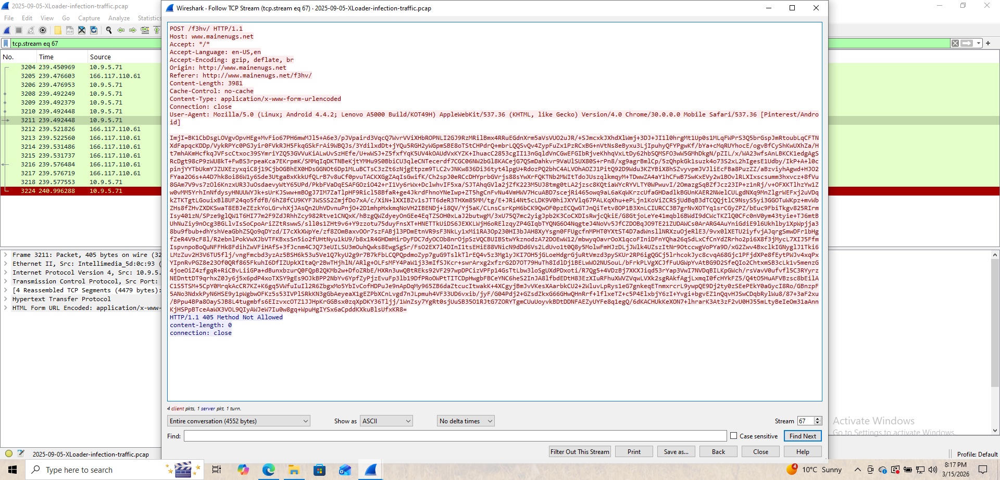
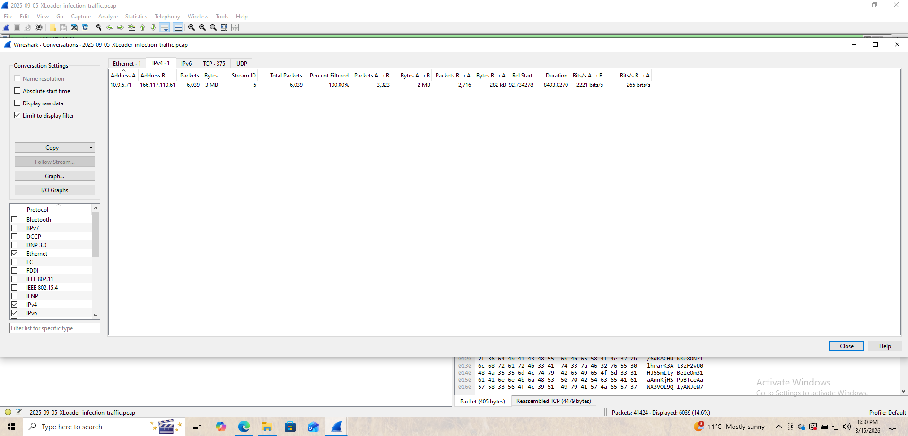

# Day 17 – Network Traffic Analysis (XLoader [formbook] Malware)

## Objective

Investigate malicious network traffic from an infected host using Wireshark and identify command-and-control communication associated with XLoader malware.

---

## Lab Environment

Analysis Tool:
Wireshark

Dataset:
XLoader infection traffic PCAP

---

## Identifying the Infected Host

DNS traffic analysis revealed repeated DNS queries originating from the internal host:

```
10.9.5.71
```

The host repeatedly queried suspicious domains, indicating possible malware activity.

---

## Suspicious DNS Activity

The infected host repeatedly attempted to resolve the domain:

```
www.thealnwickgarden.net
```

Many responses returned:

```
No such name
```

This behavior is consistent with malware attempting to locate its command-and-control server.



## Command and Control Communication

Further investigation revealed HTTP communication between the infected host and an external server.

Connection details:

```
Infected Host: 10.9.5.71
C2 Server: 166.117.110.61
Protocol: HTTP
Port: 80
```

The infected host sent an HTTP POST request to the following path:

```
POST /fshv/ HTTP/1.1
Host: www.mainenugs.net
```

This POST request contained encoded data indicating possible data exfiltration or malware beaconing.

---

## TCP Stream Analysis

Following the TCP stream revealed encoded data transmitted from the infected host to the command-and-control server.

This communication pattern strongly indicates malware activity.





---

## Network Conversation Analysis

Using Wireshark's **Statistics → Conversations** feature revealed a large volume of traffic between the infected host and the external server.

```
Host: 10.9.5.71
External Server: 166.117.110.61
Packets: 6039
Data Transferred: ~3 MB
```

This sustained communication is consistent with malware command-and-control behavior.



---

## Indicators of Compromise (IOCs)

| Indicator | Value |
|---|---|
Infected Host | 10.9.5.71 |
C2 Server | 166.117.110.61 |
Malicious Domain | www.mainenugs.net |
Suspicious URI | /fshv/ |
Protocol | HTTP |

---

## MITRE ATT&CK Mapping

| Technique | ID |
|---|---|
Command and Control over Web Protocol | T1071.001 |
Exfiltration Over Web Services | T1041 |

---

## Conclusion

Network traffic analysis revealed that the infected host (10.9.5.71) attempted to communicate with the command-and-control server (166.117.110.61) using HTTP POST requests.

The communication contained encoded data and occurred repeatedly, indicating possible malware beaconing and data exfiltration activity consistent with XLoader malware behavior.
