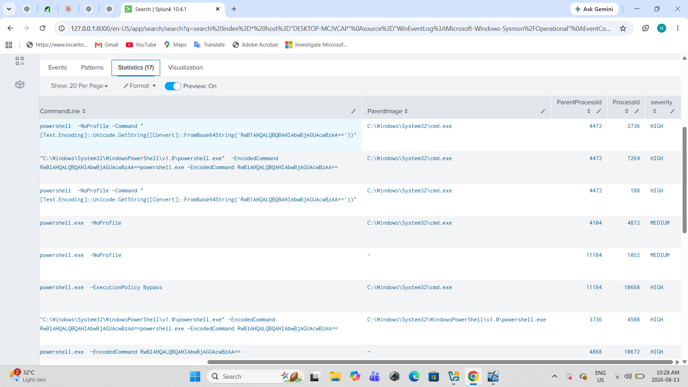
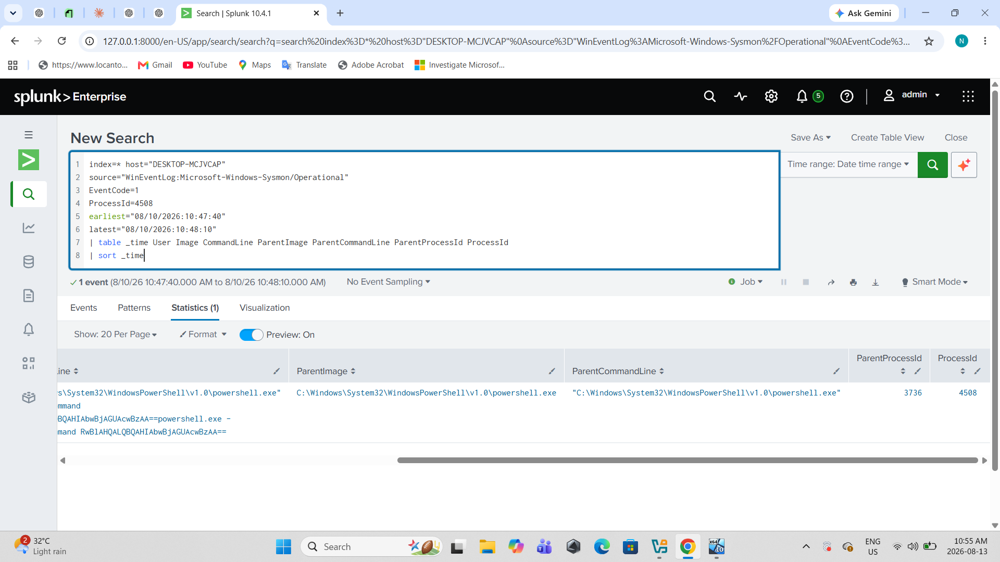
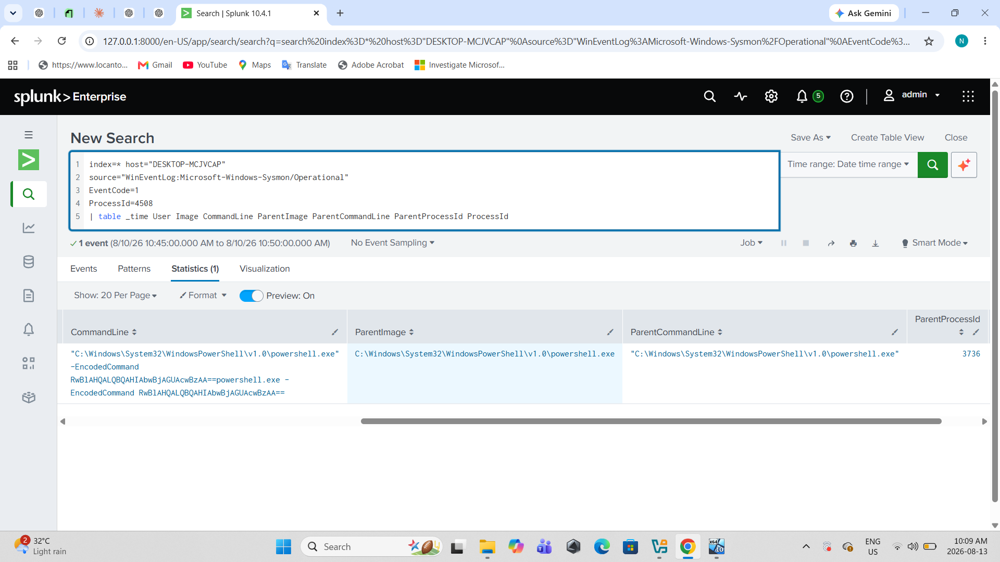
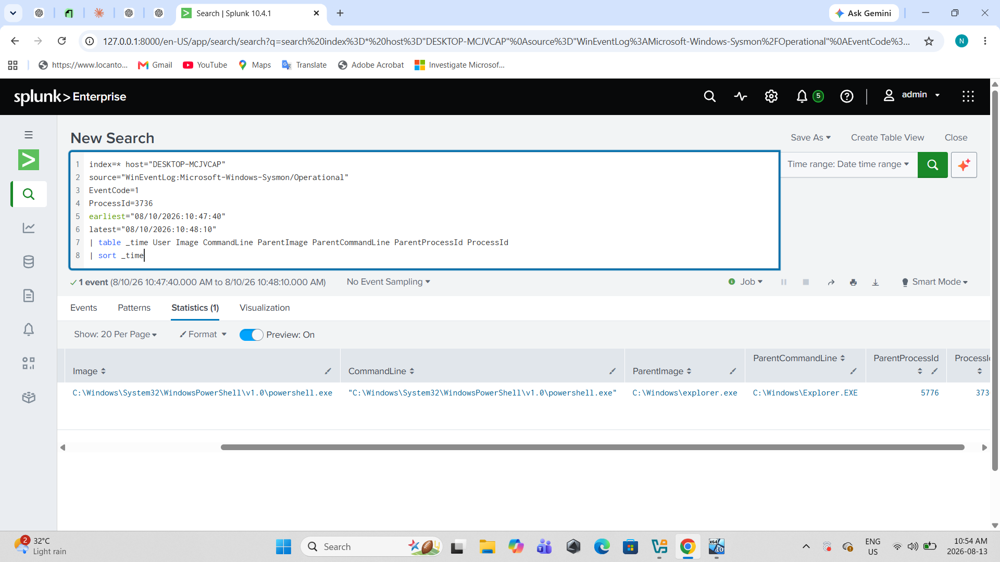
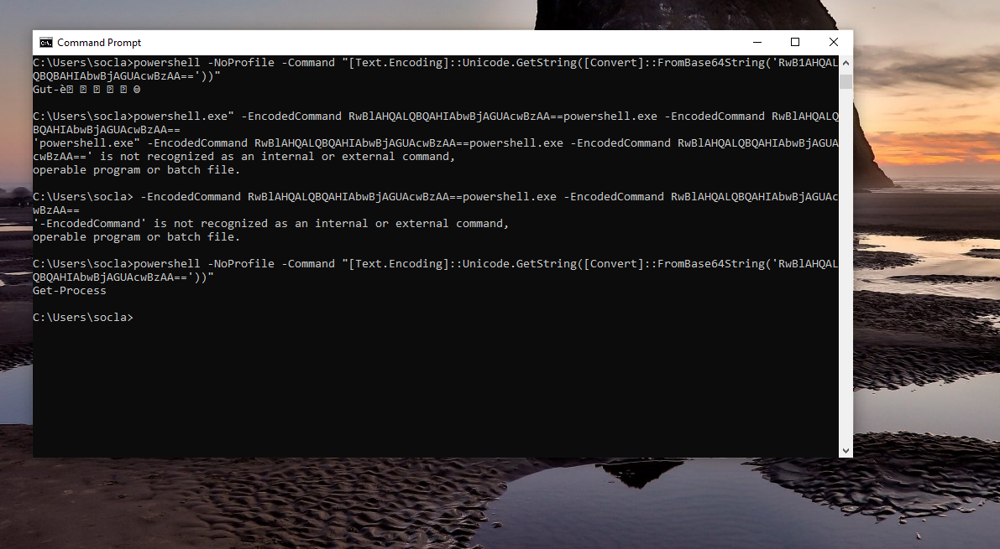

# PowerShell Encoded Command Investigation

## Executive Summary

During the investigation, I found multiple PowerShell process creation events on the host `DESKTOP-MCJVCAP`.

The main activity I focused on was a PowerShell process using the `-EncodedCommand` parameter. Since encoded PowerShell commands can be used to hide commands from normal inspection, I investigated the process, parent process and decoded the command.

The encoded command was:

`RwBlAHQALQBQAHIAbwBjAGUAcwBzAA==`

After decoding it using UTF-16LE, the command was:

`Get-Process`

`Get-Process` is a normal PowerShell command used to view running processes. Based on the events I checked, I did not find evidence of malicious activity.

The activity was therefore classified as **Benign / False Positive**.

---

## Investigation








I started by searching Sysmon Event ID 1 for PowerShell executions on the host.

```spl
index=* host="DESKTOP-MCJVCAP"
source="WinEventLog:Microsoft-Windows-Sysmon/Operational"
EventCode=1
Image="*powershell.exe"
(CommandLine="*-EncodedCommand*" OR CommandLine="*-ExecutionPolicy Bypass*" OR CommandLine="*-NoProfile*")
| table _time User Image CommandLine ParentImage ParentCommandLine ProcessId
| sort _time

The search returned multiple PowerShell events.

One of the events that stood out was:

ProcessId: 4508
Image: C:\Windows\System32\WindowsPowerShell\v1.0\powershell.exe

The command line contained:

-EncodedCommand RwBlAHQALQBQAHIAbwBjAGUAcwBzAA==

Because the command was encoded, I decided to investigate the process further instead of immediately treating it as malicious.


Process Investigation 

I searched for PID 4508 in Sysmon Event ID 1.

The process had:

ProcessId: 4508
ParentProcessId: 3736
ParentImage: powershell.exe

I then checked PID 3736.


PID 3736 was also a PowerShell process and its parent was:

ParentImage: C:\Windows\explorer.exe
ParentProcessId: 5776

So the process chain was:

explorer.exe
    |
    └── powershell.exe (PID 3736)
            |
            └── powershell.exe (PID 4508)

This showed that PID 4508 was started by another PowerShell process.


Encoded Command Analysis

The encoded command found in PID 4508 was:

RwBlAHQALQBQAHIAbwBjAGUAcwBzAA==

I decoded the Base64 value using PowerShell with UTF-16LE encoding.


The decoded command was:

Get-Process

This command is used to retrieve information about processes currently running on the Windows system.

There was nothing malicious in the decoded command itself.

Related PowerShell Activity

I also checked the surrounding PowerShell events because the host had other PowerShell activity around the same time.

Some of the events contained:

powershell.exe -NoProfile

and:

powershell.exe -ExecutionPolicy Bypass

There were also PowerShell temporary files under:

C:\Users\socla\AppData\Local\Temp\

with names similar to:

__PSScriptPolicyTest_*.ps1

These events looked suspicious initially, so I correlated them with the process IDs and timestamps instead of looking at them individually.

Timeline
Time	Activity
10:47:49.343	PowerShell PID 3736 started
10:47:55.401	PowerShell PID 4508 started
10:47:55.401	PID 4508 executed an encoded PowerShell command
10:47:55.401	Encoded command was identified
Investigation	Base64 command was decoded
Investigation	Decoded command was Get-Process
MITRE ATT&CK
T1059.001 – PowerShell

PowerShell was used to execute the command.

T1027 – Obfuscated/Compressed Files and Information

The command was Base64 encoded using PowerShell's -EncodedCommand parameter.

In this case, the encoded command itself turned out to be benign.

Conclusion

The initial PowerShell activity looked suspicious because of the use of -EncodedCommand, and there were also other PowerShell executions using -ExecutionPolicy Bypass and -NoProfile.

I traced the process tree from PID 4508 back to explorer.exe and decoded the Base64 command.

The decoded command was:

Get-Process

This is a legitimate Windows PowerShell command and I did not find evidence of malware, C2 communication, persistence or other malicious activity in the events investigated.

Final classification: Benign / False Positive.

