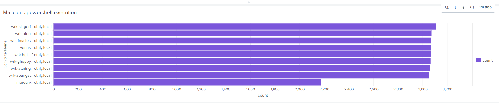

SOC Incident Investigation Report

Project: Splunk BOTSv2
Role: SOC Analyst
Date Completed: 29 November 2025

📌 Executive Summary

During the investigation of security telemetry from Splunk BOTSv2, malicious activity was identified within the Frothly corporate environment. The attacker gained unauthorized access using the service3 account on the domain controller mercury.frothly.local (10.0.1.100), executed encoded PowerShell commands, and initiated outbound Command-and-Control (C2) communication to a suspicious external IP 199.117.103.155.
The findings confirm compromise of MERCURY and active post-exploitation activity.

🛰️ Scope & Dataset Analyzed

Windows Event Logs (WinEventLog:Security)

Process Creation Logs (EventCode 4688)

Authentication Logs (EventCode 4624 / 4625)

Stream HTTP network traffic (stream:http)

DNS logs (stream:dns)

Splunk Index: botsv2

🔍 Key Investigation Findings
1. Suspicious Logon Activity

High volume of successful service account logons observed on MERCURY, suggesting credential compromise.

Screenshot: Suspicious Successful Logons by Host
[Suspicious Successful Logons](./Suspicious successful logons.png)

2. Malicious PowerShell Execution

Numerous powershell.exe executions observed, including encoded payload commands (-enc) frequently used to obfuscate malicious intent.

Screenshot: Malicious PowerShell Execution Counts

3. Encoded PowerShell Payload Identified

Command example captured:

powershell.exe -NoP -Sta -W 1 -Enc <BASE64>

Indicating script-based remote code execution and persistence preparation.

Screenshot: Encoded PowerShell Command
[Encoded PowerShell Command](./Encoded PowerShell command sample.png)

4. External C2 Network Communication

Outbound HTTP GET request from compromised MERCURY system to malicious external server.

Screenshot: C2 HTTP Traffic
[C2 External Bar](./C2 Traffic to external IP bar chart.png)

5. Multiple Internal Hosts Communicating with C2 IP

Visualization confirms repeated external connections — typical malware beaconing.

Screenshot: C2 Traffic Visualization
[C2 HTTP Event](./C2 HTTP communication event.png)

🧠 Attack Narrative / Timeline
Time	Activity
09:39:22	Brute-force login attempts (4625 failures)
09:41:02	Successful login using service3 (4624)
09:41:10	First powershell.exe spawned (4688)
09:41:25	Encoded PowerShell executed with -enc
09:41:58	HTTP GET request to external C2 199.117.103.155
Repeated	Small byte transfers consistent with beaconing

🎯 MITRE ATT&CK Mapping
Tactic	Technique	ID
Initial Access	Valid Accounts	T1078
Execution	PowerShell	T1059.001
Lateral Movement	Remote Services / RDP / SMB	T1021
C2	Application Layer Protocol (HTTP)	T1071.001
Defense Evasion	Obfuscated & Encoded Commands	T1140

🧾 Indicators of Compromise (IOC)
Type	Value
C2 IP Address	199.117.103.155
Compromised Host	mercury.frothly.local (10.0.1.100)
Suspicious Process	powershell.exe -enc
Account Misused	service3
🛡 Remediation Recommendations

Priority	Action
🔴 Critical     	Isolate MERCURY system from the network
🔴 Critical     	Disable & reset service3 credentials
🔴 Critical	      Block C2 IP 199.117.103.155 at firewall
🟡 Medium	        Enable PowerShell script block & transcription logging
🟡 Medium	        Deploy EDR behavior-based protection
🟢 Low	          Conduct internal lateral movement investigation on connected hosts

🏁 Conclusion

Analysis confirms that MERCURY was compromised and the attacker executed obfuscated PowerShell that established C2 communication to an external server. The incident demonstrates post-exploitation behavior requiring immediate containment.

This investigation validates real-world SOC workflow including log analysis, threat hunting, MITRE mapping, and summarizing evidence with visual dashboards.
