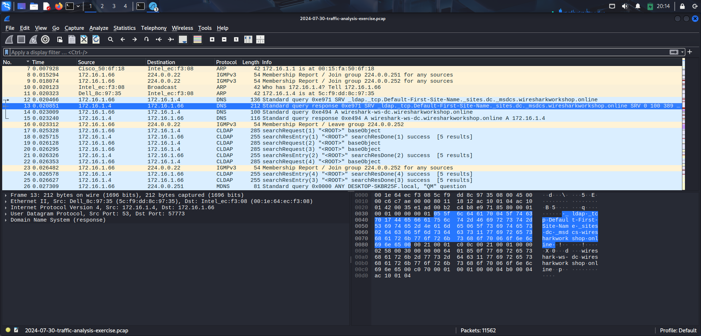

# SOC Incident Report: STRRAT Malware C2 Activity

**Analyst:** Nitin
**Date of Analysis:** August 2026
**Source PCAP:** 2024-07-30-traffic-analysis-exercise.pcap ("You Dirty Rat!" — malware-traffic-analysis.net)
**Tools used:** Suricata 8.0.6 (Emerging Threats Open ruleset), Wireshark 4.4.7

## Executive Summary

Suricata IDS analysis of the provided PCAP identified sustained Command and Control (C2) beacon traffic consistent with the STRRAT remote access trojan (RAT). The infected host (`172.16.1.66`) communicated with an external C2 server (`141.98.10.79:12132`) approximately every 5 seconds for the duration of the capture (~10 minutes), transmitting host fingerprinting data and periodic snapshots of the victim's active window title, indicating active reconnaissance/surveillance capability. The C2 IP is independently listed on Spamhaus's DROP list, corroborating the malicious classification. The pcap capture window does not include the initial infection event; based on available evidence, infection had already occurred prior to capture start.

## Victim Details

| Field | Value |
|---|---|
| Internal IP | 172.16.1.66 |
| Hostname | DESKTOP-SKBR25F |
| Logged-in user | ccollier |
| Operating System | Microsoft Windows 11 Pro, 64-bit |
| Antivirus | Windows Defender |
| Domain | wiresharkworkshop.online |
| Domain Controller | 172.16.1.4 (wireshark-ws-dc.wiresharkworkshop.online) |

## Timeline of Events

| Time (UTC) | Event |
|---|---|
| 08:08:49 | NTLM authentication to domain controller (172.16.1.4) — routine domain activity |
| 08:08:49 | Microsoft Connection Test (www.msftconnecttest.com) — routine Windows connectivity check |
| 08:10:06 | First Spamhaus DROP list alert for inbound traffic from 141.98.10.79 |
| 08:10:06 | External IP lookup via DNS (ip-api.com) |
| 08:10:07 | External IP lookup via HTTP (ip-api.com/json/) — returned victim's public geolocation (Austin, TX) |
| 08:10:07 | First ET MALWARE STRRAT CnC Checkin alert |
| 08:10:07 – 08:18:34 | Continuous STRRAT beacon traffic to 141.98.10.79:12132, approx. every 5 seconds |

## Technical Analysis

Suricata flagged repeated `ET MALWARE STRRAT CnC Checkin` alerts (SID 2030358) between the infected host and `141.98.10.79:12132` over TCP. Manual inspection in Wireshark (Follow TCP Stream) confirmed the beacon payload is transmitted in **plaintext**, pipe-delimited:

ping|STRRAT|1BE8292C|DESKTOP-SKBR25F|ccollier|Microsoft Windows 11 Pro|64-bit|Windows Defender||1.6|US:United States|Not Installed|[uptime]

This includes the malware family name, a build/campaign identifier (`1BE8292C`), full host fingerprinting, and a running session-uptime counter — confirming a single, persistent C2 session rather than repeated reconnects.

A subset of beacons include an additional Base64-encoded field, which decodes to the victim's **active window title** at time of check-in, e.g.:
- `Documents`, `Pictures`, `Program Manager` (desktop)
- `pounds-formula [Compatibility Mode] - PowerPoint`
- `Fanad Head Lighthouse - Paint`

This indicates STRRAT was actively reporting user activity/application focus back to the C2 operator — surveillance behavior beyond a simple heartbeat.

The C2 IP (`141.98.10.79`) independently triggered a separate `ET DROP Spamhaus DROP Listed Traffic Inbound` alert, corroborating the malicious classification via a second, unrelated threat intelligence source.

## Initial Access

No evidence of the initial infection vector was found within this capture. HTTP traffic to `www.msftconnecttest.com` (Windows connectivity check) and HTTPS connections to `mobile.events.data.microsoft.com` / `go.microsoft.com` (Microsoft telemetry) prior to the first C2 alert were reviewed and assessed as benign. Given STRRAT's common distribution method (malicious email attachments, often disguised `.jar` or archive files) and the absence of any download/dropper activity in this window, infection likely occurred prior to the start of this capture.

## Indicators of Compromise (IOCs)

| Type | Value | Notes |
|---|---|---|
| C2 IP | 141.98.10.79 | Port 12132, also Spamhaus DROP-listed |
| C2 Port | 12132 | TCP |
| Malware family | STRRAT | Confirmed via plaintext beacon content |
| Build ID | 1BE8292C | Embedded in beacon traffic |
| Victim hostname | DESKTOP-SKBR25F | |
| Victim IP | 172.16.1.66 | Internal |

## MITRE ATT&CK Mapping

| Tactic | Technique |
|---|---|
| Command and Control | Application Layer Protocol (T1071) |
| Command and Control | Non-Standard Port (T1571) — C2 on port 12132 |
| Discovery | System Information Discovery (T1082) |
| Discovery | Application Window Discovery (T1010) |
| Reconnaissance | Gather Victim Network Information — IP Addresses (T1590.005) |

## Recommended SOC Response

- Isolate host DESKTOP-SKBR25F from the network immediately
- Block C2 IP 141.98.10.79 (all ports) at the perimeter firewall
- Search environment-wide logs for any other hosts communicating with 141.98.10.79
- Rotate credentials for user ccollier
- Full malware scan / reimage of the affected host, given STRRAT's known persistence and credential-theft capabilities
- Review email gateway logs for the likely delivery vector (attachment-based), given no download activity was observed in this capture window

## Limitations

- This analysis is based on a single, time-bounded PCAP; the initial infection vector was not captured

## Screenshots

**LDAP/domain traffic confirming the environment (wiresharkworkshop.online domain):**

**Decoded STRRAT C2 beacon stream (Follow TCP Stream), showing plaintext malware check-in data:**

- Domain age/reputation checks were not performed against the C2 IP beyond the Spamhaus DROP list already present in the ruleset
- Only the primary C2 conversation was analyzed in depth; other flagged hosts/protocols in the capture were not exhaustively reviewed
