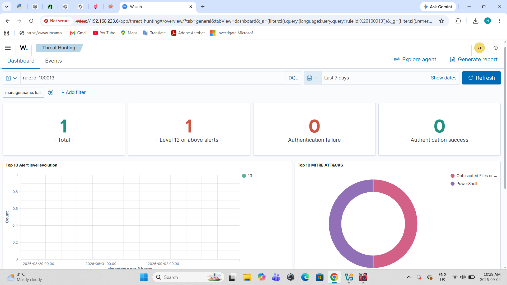
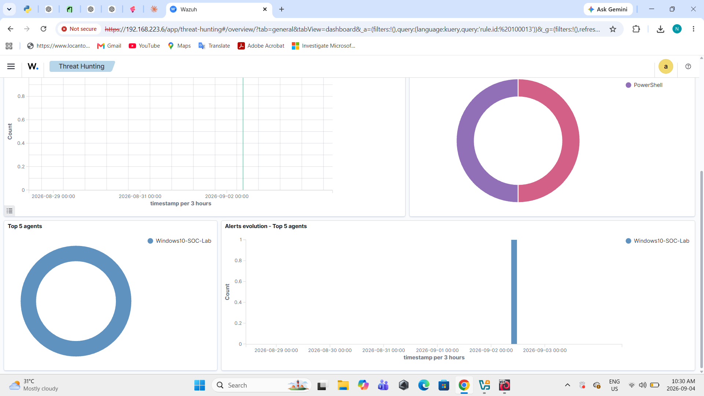
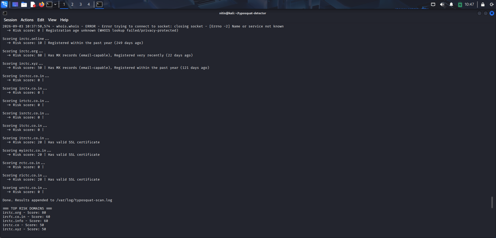
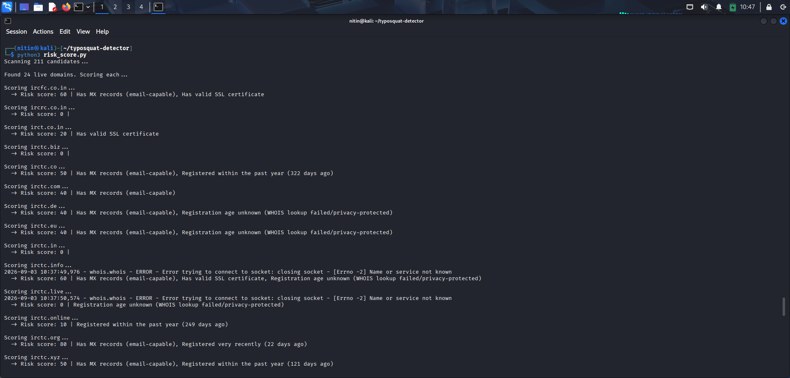
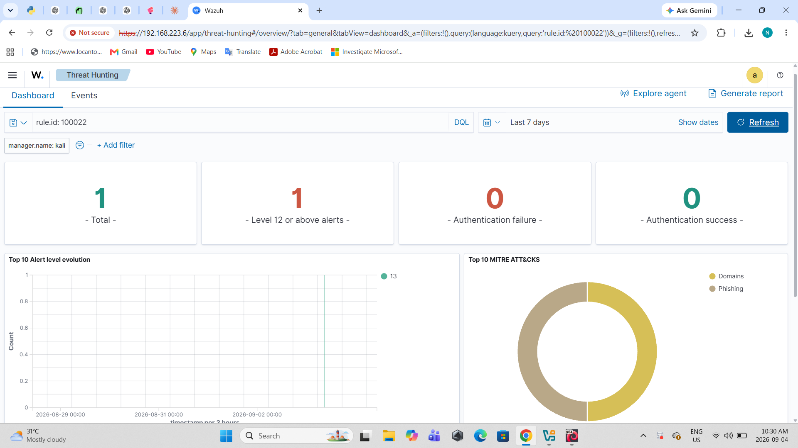
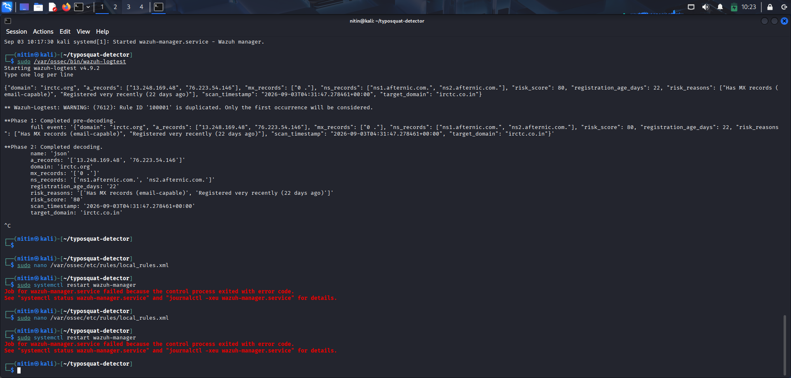

# Wazuh EDR + Proactive Typosquat Detection Lab

A two-part SOC project: a Wazuh-based endpoint detection lab with custom
detection rules, integrated with a self-built typosquat/lookalike-domain
scanner that feeds proactive threat intelligence directly into the same
SIEM dashboard.

The goal was to go beyond "install a tool and take a screenshot" and build
something that actually correlates two different detection sources — endpoint
behavior and external domain threat intel — into one unified alerting
pipeline, the way a real small SOC would.

## Why this project

Most typosquat-detection portfolio projects stop at running `dnstwist` and
showing the output. Most EDR projects stop at installing Wazuh and showing
a dashboard screenshot. This project does both, but treats the typosquat
scanner as a genuine intelligence *feed* into the SIEM — new lookalike
domain findings get scored, logged, and alert like any other detection
source, with MITRE ATT&CK mapping and a severity tier.

## Architecture

┌─────────────────────┐ ┌──────────────────────────┐
│ Windows10-SOC-Lab VM │ │ Kali Linux VM │
│ │ │ │
│ Sysmon (process │ agent │ Wazuh Manager │
│ creation logging) │────────▶│ Wazuh Indexer │
│ │ :1514 │ Wazuh Dashboard │
└──────────────────────┘ │ │
│ Custom rules: │
┌──────────────────────┐ │ - PowerShell/LOLBin │
│ Typosquat Scanner │ JSON │ (T1059.001) │
│ (Python, cron-ready) │ log │ - Typosquat findings │
│ - permutation engine │────────▶│ (T1583.001, T1566) │
│ - DNS resolution │ │ │
│ - WHOIS + SSL scoring│ └──────────────────────────┘
└──────────────────────┘

Both VMs communicate over a host-only VirtualBox network
(`192.168.223.0/24`).

---

## Part 1 — Wazuh EDR Lab

### Setup
- **Manager + Indexer + Dashboard**: all-in-one install on Kali Linux
  (VirtualBox VM)
- **Agent**: deployed on a Windows 10 VM (`Windows10-SOC-Lab`)
- **Telemetry source**: Sysmon (SwiftOnSecurity-style config), forwarding
  Event ID 1 (Process Create) to the Wazuh agent via a custom
  `<localfile>` eventchannel entry

### Custom detection rules — PowerShell stealth execution (T1059.001)

Wazuh ships a large built-in Sysmon ruleset (encoded-command detection,
certutil abuse, WMI-spawned PowerShell, and more). Before writing anything
new, I reviewed the existing ruleset (`0800-sysmon_id_1.xml`) to avoid
duplicating coverage, and found a gap: no existing rule specifically
targeted the classic **hidden-window + execution-policy-bypass** combo —
a very common "stealthy launch" pattern that's distinct from the
encoded-command case Wazuh already covers.

Four rules were added:

| Rule ID | Level | Trigger |
|---|---|---|
| 100010 | 8 | PowerShell launched with `-WindowStyle Hidden` |
| 100011 | 8 | PowerShell launched with `-ExecutionPolicy Bypass` |
| 100012 | 8 | PowerShell launched with `-NoProfile` |
| 100013 | 13 | Hidden window **and** bypass flag together (high-confidence) |

All four map to MITRE ATT&CK **T1059.001** (Command and Scripting
Interpreter: PowerShell); rule 100013 additionally maps to **T1027**
(Obfuscated Files or Information).

**Validation**: each rule was fired individually and in combination using
live PowerShell commands on the Windows agent, and confirmed end-to-end in
the Wazuh dashboard with correct severity and MITRE tagging.

---

## Part 2 — Typosquat / Lookalike Domain Scanner

### Target
[`irctc.co.in`](https://www.irctc.co.in) — India's national railway
ticketing platform, chosen as a realistic, high-value target given its
scale and popularity as a phishing lure.

### How it works

**1. Permutation engine** (`permute.py`)
Generates candidate lookalike domains using standard typosquatting
categories:
- Omission (dropped character)
- Insertion (extra character)
- Transposition (swapped adjacent characters)
- Keyboard-adjacent substitution
- TLD swaps (19 common/abused extensions)
- Dictionary prefix/suffix injection (`my-`, `secure-`, `login-`, etc.)

**2. DNS resolution** (`scanner.py`)
Checks each candidate for live A/MX/NS records using explicit public
resolvers (8.8.8.8 / 1.1.1.1) rather than relying on system DNS — this
was a deliberate fix after discovering the lab's default resolver
returned false negatives due to unreachable nameservers ahead of a
working one in `/etc/resolv.conf`.

**3. Risk scoring** (`risk_score.py`)
For every domain that resolves, the tool checks:
- **MX records present** (+40) — email-capable, phishing-ready
- **Valid SSL certificate** (+20) — looks production-ready
- **Registration age** via WHOIS (+40 if <30 days, +25 if <90 days,
  +10 if <1 year)

Findings are written as JSON Lines to `/var/log/typosquat-scan.log`,
ready for SIEM ingestion.

### Validation against dnstwist

The tool's coverage was benchmarked against the industry-standard
`dnstwist` scanner. Initial coverage gap: dnstwist found 30 registered
domains against this tool's 16, almost entirely due to a narrower TLD
list and no dictionary-based permutations. After expanding both, this
tool's live-domain coverage rose to 24 (out of 211 candidates), closing
most of the gap while keeping the risk-scoring layer dnstwist doesn't
provide.

### Key finding

| Domain | Score | Why |
|---|---|---|
| **irctc.org** | **80** | Registered 22 days prior, active MX records |
| ircfc.co.in | 60 | Active MX (mailhostbox.com), valid SSL cert |
| irctc.info | 60 | Active MX, valid SSL cert |
| irctc.co | 50 | Active MX, registered within the past year |
| irctc.xyz | 50 | Active MX, registered within the past year |

`irctc.org`'s nameservers (`ns1.afternic.com`) indicate it is listed on
GoDaddy's domain marketplace rather than actively hosting a phishing
site — a useful reminder that a high risk score flags something worth
investigating, not a confirmed attack. This is called out explicitly
rather than glossed over.

---

## Part 3 — Integration: Feeding Wazuh from the Scanner

1. Wazuh's built-in JSON decoder was pointed at the scanner's log file via
   a `<localfile>` entry with `log_format: json` — no custom decoder was
   needed since Wazuh parses JSON Lines natively.
2. Three custom rules were added, mirroring the tiered approach used for
   the PowerShell detections:

| Rule ID | Level | Trigger |
|---|---|---|
| 100020 | 5 | Any typosquat finding logged (baseline visibility) |
| 100021 | 10 | Risk score 50–79 (medium risk) |
| 100022 | 13 | Risk score 80+ (high risk — possible active phishing infra) |

All three map to **T1583.001** (Acquire Infrastructure: Domains); 100021
and 100022 additionally map to **T1566** (Phishing).

3. Validated end-to-end: `irctc.org` correctly fired rule 100022 at
   level 13 with full MITRE tagging visible in the dashboard.

---

## Troubleshooting notes

This project involved a fair amount of real infrastructure
troubleshooting worth documenting on its own merit:

- **VirtualBox VM config corruption**: a `.vbox` file was emptied during
  a host-side disk cleanup, making the VM show as "Inaccessible."
  Recovered using VirtualBox's automatic `.vbox-prev` backup — no data
  loss, since the actual `.vdi` disk was untouched.
- **Partition vs. virtual disk mismatch**: resizing a VirtualBox virtual
  disk does *not* automatically grow the partition/filesystem inside the
  guest OS. Fixed using a GParted Live boot to shrink-and-shift the
  adjacent partition, then grow the root partition into the freed space.
- **Recurring disk exhaustion**: Wazuh's vulnerability-detection module
  repeatedly filled the `/var` partition with CVE feed data, indirectly
  breaking the graphical login (X couldn't write its authority file).
  Root-caused by tracing from a black screen → lightdm crash loop →
  X authority write failure → disk full → `/var/ossec/queue/vd` bloat.
  Permanently resolved by disabling the vulnerability-detection module,
  since this lab only monitors one Windows endpoint and doesn't need
  cross-distro CVE feeds.
- **DNS false negatives**: the scanner initially reported zero live
  domains due to a too-short resolver timeout budget being exhausted by
  broken nameservers listed ahead of a working one. Fixed by explicitly
  configuring public DNS resolvers with an appropriate timeout.
- **Broken Wazuh dashboard cert chain**: a disk-full event during install
  left the dashboard's SSL certificate directory missing entirely, while
  indexer and filebeat certs were present. Rather than manually patch
  individual certs (fragile, easy to mismatch), a full `-o` (overwrite)
  reinstall was used to regenerate a consistent certificate chain across
  all components.

## What I'd improve next

- Automate the scanner on a schedule (cron) rather than running manually
- Add certificate-transparency log monitoring (catches newly issued certs
  before DNS even propagates, often faster than WHOIS-based detection)
- Expand the dictionary-word list and add full alphabet substitution
  (not just keyboard-adjacent) to further close the gap with dnstwist
- Add a lightweight "domains worth purchasing" ranked output as a
  separate report, distinct from the raw alert feed

## Tech stack

Python 3.13 · dnspython · python-whois · Wazuh 4.9.2 (Manager, Indexer,
Dashboard) · Sysmon · VirtualBox (Kali Linux + Windows 10 lab VMs)
